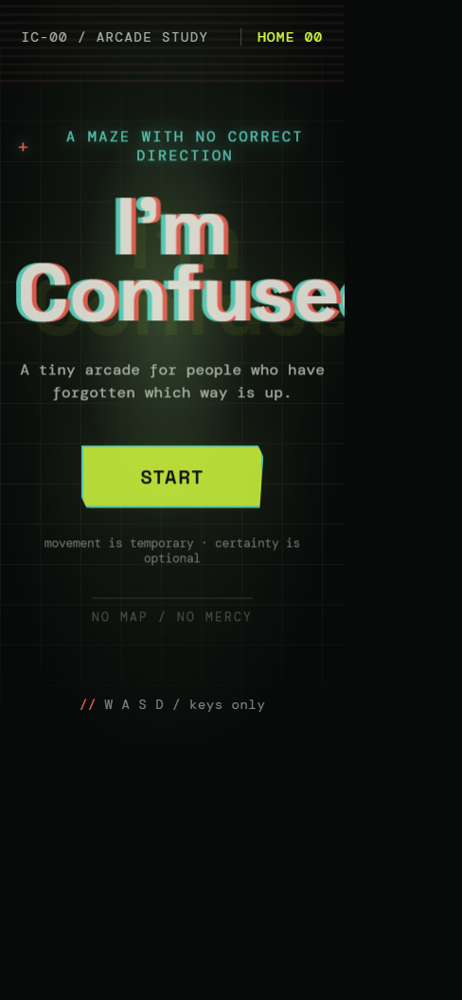
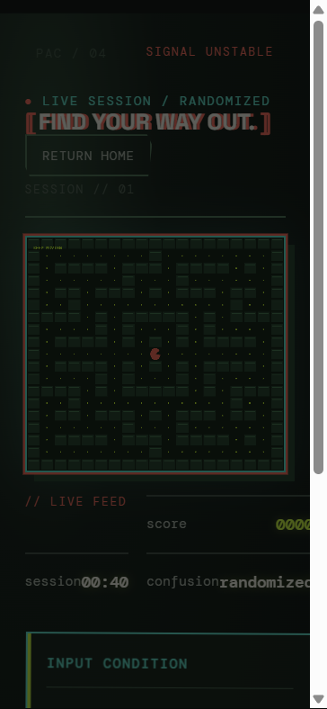
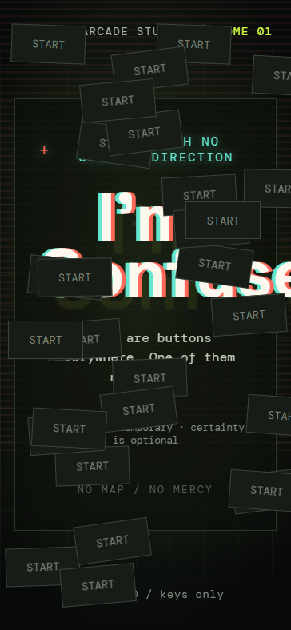
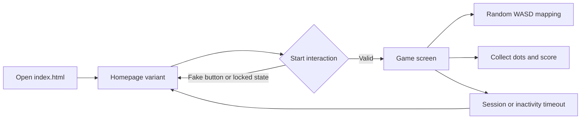

# [I'M CONFUSED] 🎯

## Basic Details
### Team Name: [LoLoPoLo]

### Team Members
- Team Lead: [Meenu Jasmine] - [LBS Institute of Technology for Women]
- Member 2: [Drisya DC] - [LBS Institute of Technology for Women]

### Project Description
[“I’m Confused” is a chaotic Pac-Man-style game where you dodge through a maze using WASD controls that randomly switch, reverse, or completely troll you. With glitchy home screens, fake buttons, time limits, and unhinged visuals, the game basically asks this: Will you survive the confusion?]

### The Problem (that doesn't exist)
[We’re solving the extremely real crisis of **Pac-Man being way too good at directions**.]

[Because why should left mean left? Every normal control is suspicious, the keyboard is plotting, and Pac-Man needs to be humbled immediately.] 

### The Solution (that nobody asked for)
[We solve this very serious crisis by turning a basic Pac-Man game into a full keyboard trust exercise. The WASD controls randomly switch, reverse, or completely betray the player, while glitchy screens and suspicious Start buttons add extra chaos.

It’s fun, unpredictable, and mildly stressful, because apparently even Pac-Man needed a villain arc.]

## Technical Details
### Technologies/Components Used
For Software:
- HTML5
- CSS3
- JavaScript (Vanilla JS)
- HTML Canvas API
- Web Storage API (`localStorage`)
- VS Code and modern web browser

### Implementation
For Software:
# Installation
No installation is required. The project is a standalone HTML file with inline CSS and JavaScript.

# Run
1. Open `index.html` in a modern web browser.
2. Click **Start** on the homepage.
3. Use `W`, `A`, `S`, and `D` to control Pac-Man.

The game can also be served locally with any static web server, such as the VS Code Live Server extension.

### Project Documentation
For Software:

# Screenshots (Add at least 3)

*The normal homepage introduces the game and its Start button.*

*The Pac-Man-style maze with score, timer, dots, and randomized control mode.*

*A glitched homepage variant with unstable visuals and misleading Start buttons.*

# Diagrams

*The workflow shows how homepage variants lead into the randomized Pac-Man game and back again.*

### Project Demo
# Video
[Add demo video link here]
*The demo video shows the normal homepage, the chaotic homepage variants, the fake Start buttons, and the Pac-Man-style game with normal, reversed, interchanged, and randomized WASD controls.*

## Team Contributions
- [Meenu Jasmine]: Designed the game concept, implemented the Pac-Man-style maze, randomized WASD controls, timers, scoring, and homepage progression logic.
- [Drisya DC]: Developed the chaotic UI designs, glitch effects, homepage button interactions, responsive styling, project documentation, and testing.

---
Made with ❤️ at TinkerHub Useless Projects 

